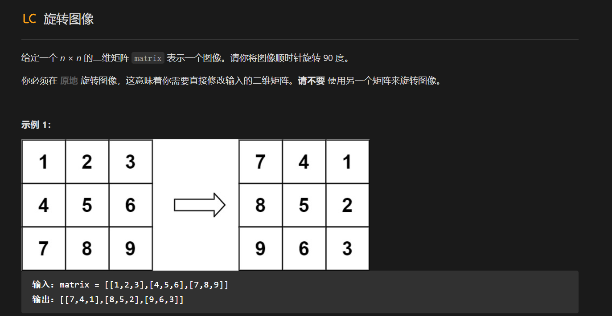

# 题目



# 思路

因为旋转必须要把所有元素都访问一遍，同时因为是二维数组，所以最低时间复杂度就为O(n<sup>2</sup>)。

所以本题直接使用双循环求解。

先进行上下对换，再进行对角线对换。以此完成本题

```c++
#include <iostream>
#include <vector>
using namespace std;

class Solution {
public:
    void rotate(vector<vector<int>>& matrix) {
        for (int i = 0; i < matrix.size()/2; ++i) {
            for (int j = 0; j < matrix.size(); ++j) {
                int tmp = matrix[matrix.size() - i - 1][j];
                matrix[matrix.size() - i - 1][j] = matrix[i][j];
                matrix[i][j] = tmp;
            }
        }
        for (int i = 0; i < matrix.size(); ++i) {
            for (int j = 0; j < i; ++j) {
                int tmp = matrix[i][j];
                matrix[i][j] = matrix[j][i];
                matrix[j][i] = tmp;
            }
        }
//        for (const auto &row: matrix) {
//            for (auto i:row) {
//                cout << i << " ";
//            }
//            cout << endl;
//        }
    }
};

int main() {
    Solution a;
    vector<vector<int>> b = {{1,2,3},{4,5,6},{7,8,9}};
    a.rotate(b);
    return 0;
}
```

